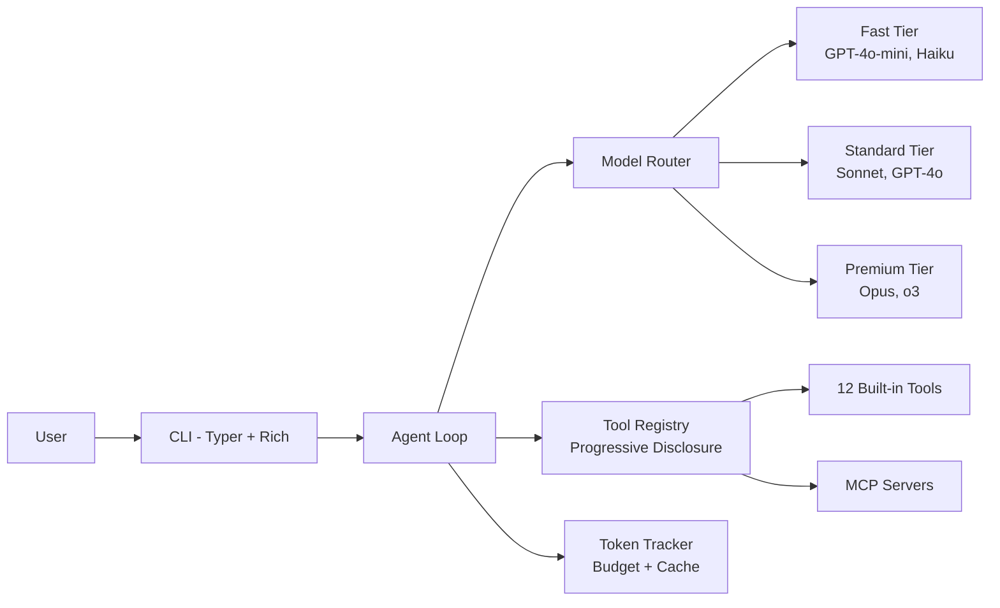

# AutoGenesis

**The token-efficient agent framework. CLI-first. Self-improving. Every token counts.**

[](https://pypi.org/project/autogenesis/)
[](https://pypi.org/project/autogenesis/)
[](https://opensource.org/licenses/MIT)
[](https://github.com/graydeon/AutoGenesis/actions/workflows/ci.yml)

## Install in 30 Seconds

```bash
pipx install autogenesis
# or
uv tool install autogenesis
```

## Getting Started in 5 Minutes

```bash
# Initialize a project
autogenesis init

# Start an interactive chat
autogenesis chat

# Run a single task
autogenesis run "describe this project and list its files"

# Check token usage
autogenesis tokens report
```

## Features

### 1. Self-Improving Prompts

AutoGenesis refines its own system prompts over time. A constitutional safety layer ensures optimizations never violate core safety rules. Version-controlled prompts with rollback support.

### 2. Token Efficiency

Every operation minimizes token consumption:
- **Progressive tool disclosure** — only load tool definitions the model needs
- **Exact-match caching** — skip redundant API calls
- **Context compression** — truncate old tool outputs automatically
- **Budget enforcement** — session, daily, and monthly cost limits

### 3. Hardware Efficiency

Resource-aware scheduling with three-tier model routing. Use fast models for simple tasks, premium models only when needed. Automatic fallback chains.

### 4. Security and Self-Pentesting

Defense-in-depth security model:
- Input/output guardrails (prompt injection, PII detection)
- Tamper-proof audit logging with hash chains
- Built-in adversarial scanning (`autogenesis scan`)
- Tool and MCP server allowlisting

### 5. CLI-First Architecture

Built with Typer and Rich for a beautiful terminal experience. Unix philosophy: composable, scriptable, pipe-friendly.

```bash
echo "fix the bug in main.py" | autogenesis run
autogenesis tokens report --json | jq '.total_cost_usd'
```

## Architecture



## Why AutoGenesis?

| Feature | AutoGenesis | LangChain | CrewAI | AutoGen |
|---|---|---|---|---|
| Token tracking | Built-in, per-tool | Manual | None | Basic |
| Progressive tool disclosure | Yes | No | No | No |
| Prompt self-improvement | Constitutional | No | No | No |
| CLI-first | Native | Wrapper | Wrapper | No |
| Context compression | Automatic | Manual | No | No |
| Security scanning | Built-in | No | No | No |
| Core runtime size | < 2,000 LOC | 100K+ LOC | 10K+ LOC | 50K+ LOC |

## Contributing

See [CONTRIBUTING.md](CONTRIBUTING.md) for development setup and guidelines.

```bash
git clone https://github.com/graydeon/AutoGenesis.git
cd AutoGenesis
./scripts/dev-setup.sh
```

## License

MIT License. See [LICENSE](LICENSE) for details.

## Built in Public

AutoGenesis is built transparently. Every architectural decision is documented, every prompt is version-controlled, and every token is counted. Follow development on [GitHub](https://github.com/graydeon/AutoGenesis).
